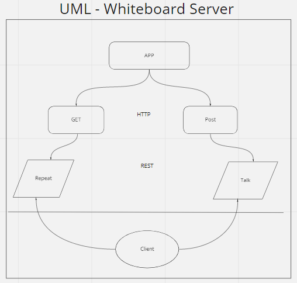

# server-deployment-practice

# Express Server

Created by Jacob Knaack
Followed along and retyped by Alex Grazda

## Summary of Problem Domain
Creating a Server and Deploying to Heroku

## Links to application deployment  
[Testing Deployment DEV](https://alexgrazda-server-deploy-dev.herokuapp.com/)  
[Testing Deployment PROD](https://alexgrazda-server-deploy-prod.herokuapp.com/)  
[GET ROUTE-Repeat](https://alexgrazda-server-deploy-prod.herokuapp.com/repeat)

## Include embedded UML

## Routes

* HTTP GET
  * Path: /repeat
    * responds with the last string used in post route `/talk`.

* HTTP POST
  * Path: /talk
    * Accepts a string.
    * responds with a string in all caps.